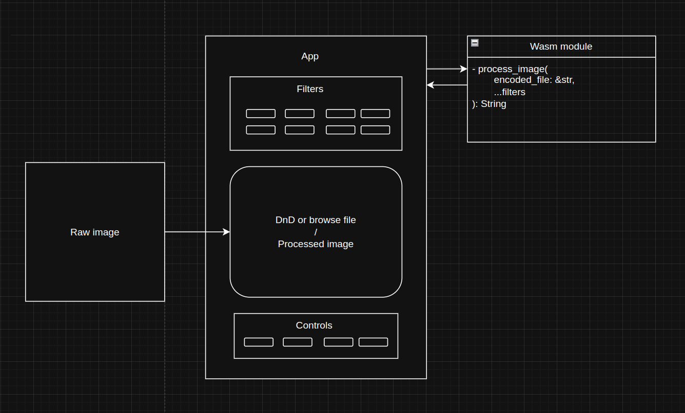

  <h1><code>wasm-image-crop</code></h1>Built with 🦀🕸⚛️

<a href="https://wasm-image-crop.vercel.app/">Deployment link</a>

## Overview

___
Project utilize WebAssembly module written in Rust for image data processing.

Image processing is based on Rust [Image](https://crates.io/crates/image) and [base64](https://crates.io/crates/base64)
libraries.

## Workflow

___

- User opens files browser to pick an image or just drop an image in the marked area
- Changing filters, users sees processed result printed to the image
- Footer controls allow clearing loaded image, reset filters or download processed image as file

## Stack

___

- [wasm-pack](https://rustwasm.github.io/) by The Rust and WebAssembly Working Group
- [Webpack](https://webpack.js.org/)
- [React](https://react.dev/)
- [Typescript](https://www.typescriptlang.org/)
- [MUI](https://mui.com/)

## License

___
Licensed under either of at your option.

* Apache License, Version 2.0, [LICENSE-APACHE](LICENSE-APACHE) or http://www.apache.org/licenses/LICENSE-2.0
* MIT license [LICENSE-MIT](LICENSE-MIT) or http://opensource.org/licenses/MIT

